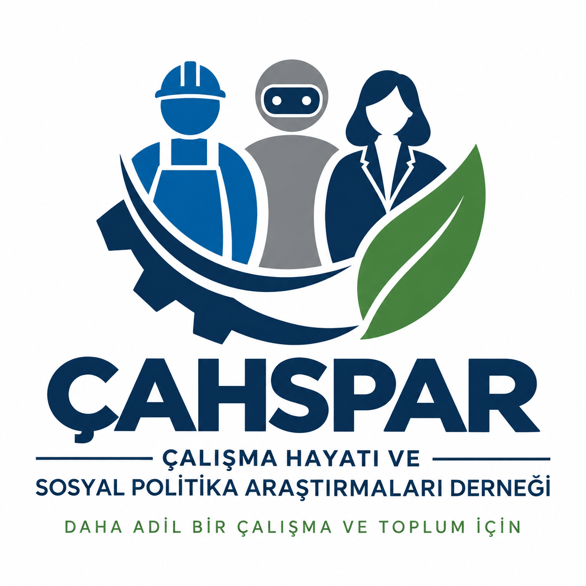

::: {.hero}

{width=2080px fig-align="center"}

<a class="social-link social-linkedin" href="https://www.linkedin.com/company/%C3%A7al%C4%B1%C5%9Fma-hayat%C4%B1-ve-sosyal-politika-ara%C5%9Ft%C4%B1rmalar%C4%B1-derne%C4%9Fi/?viewAsMember=true" target="_blank" rel="noopener noreferrer" aria-label="ÇAHSPAR LinkedIn">
	<svg viewBox="0 0 24 24" aria-hidden="true" focusable="false">
		<path d="M4.98 3.5C4.98 4.88 3.87 6 2.5 6S0 4.88 0 3.5 1.11 1 2.48 1h.02c1.37 0 2.48 1.12 2.48 2.5zM.5 8h4V24h-4V8zm7 0h3.83v2.19h.06c.53-1.01 1.84-2.19 3.79-2.19 4.05 0 4.8 2.67 4.8 6.15V24h-4v-7.2c0-1.72-.03-3.93-2.4-3.93-2.4 0-2.77 1.87-2.77 3.81V24h-4V8z"/>
	</svg>
</a>

:::

::: {.home-intro}
ÇAHSPAR, çalışma hayatı ve sosyal politika alanına yönelik kar amacı gütmeyen, yenilikçi ve sürdürülebilir araştırma, eğitim, proje ve danışmanlık faaliyetleri ile çalışma yaşamının ve toplumsal hayatın kalitesinin arttırılması amacıyla kurulmuştur. Dernek, bilimsel bilgi üretimini, mesleki eğitim ve kamu-üniversite-sivil toplum iş birliklerini bir araya getirerek daha adil ve sürdürülebilir bir çalışma yaşamı için katkı sunmayı hedefler.
:::

## Faaliyetlerimiz

- Araştırma raporları ve politika notları yayımlamak
- Akademik çalışmalar ve süreli yayınlar geliştirmek
- Eğitim, seminer, konferans ve çalıştaylar düzenlemek
- Ulusal ve uluslararası projeler yürütmek
- Çalışma hayatında eşitlik, kapsayıcılık ve sürdürülebilirlik için çözüm üretmek

## Duyurular

Etkinlik, yayın ve proje duyuruları bu alanda yer alacaktır.

[ÇAHSPAR hakkında daha fazla bilgi →](about.qmd)
