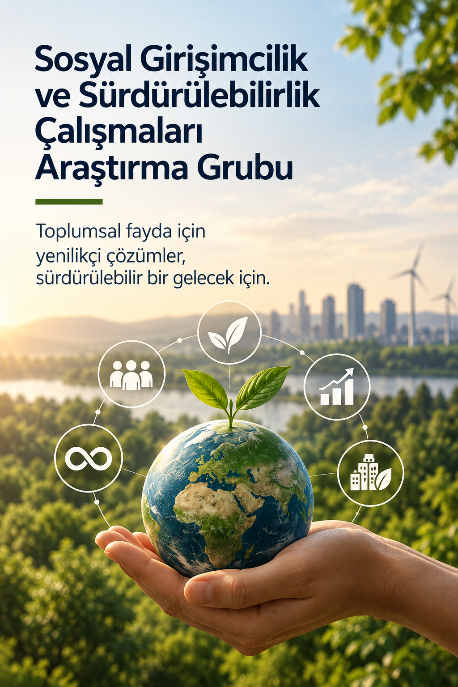

{fig-alt="Sosyal Girişimcilik ve Sürdürülebilirlik Çalışmaları Araştırma Grubu" fig-align="center" width="100%"}

### Hakkında

Sosyal Girişimcilik ve Sürdürülebilirlik Çalışmaları Araştırma Grubu; toplumsal sorunlara yenilikçi ve sürdürülebilir çözümler geliştiren sosyal girişimleri, sosyal inovasyonu ve sürdürülebilir kalkınma yaklaşımlarını disiplinlerarası bir perspektifle araştırır.

Grubun temel amacı; ekonomik değer ile sosyal ve çevresel değeri birlikte ele alan girişimcilik modellerini incelemek, sosyal sorunların çözümünde girişimci yaklaşımların rolünü araştırmak ve sürdürülebilir toplumsal dönüşüme katkı sağlayacak bilimsel bilgi üretmektir.

Araştırmalar; sosyal girişimlerin ortaya çıkışı, gelişimi ve sosyal etkilerinden sosyal ve dayanışma ekonomisine, sürdürülebilir iş modellerinden sosyal inovasyona kadar geniş bir alanı kapsar.

### Öncelikli Araştırma Alanları

- Sosyal girişimcilik
- Sosyal inovasyon
- Sürdürülebilir girişimcilik
- Sosyal ve dayanışma ekonomisi
- Sosyal girişimlerin finansmanı
- Sosyal etki ve etki ölçümü
- Sürdürülebilir iş modelleri
- Birleşmiş Milletler Sürdürülebilir Kalkınma Amaçları
- Döngüsel ekonomi ve kaynak verimliliği
- Yeşil girişimcilik ve yeşil dönüşüm
- Sosyal girişimlerde yönetişim ve paydaş ilişkileri
- Kadın ve genç sosyal girişimciliği
- Sosyal girişimlerde dijital dönüşüm
- Kooperatifçilik ve kolektif girişim modelleri
- Yerel ve bölgesel kalkınma
- Sosyal girişimcilik ekosistemleri
- Kamu, özel sektör ve sivil toplum iş birlikleri
- Toplumsal sorunlara yenilikçi çözümler

### Araştırma Yaklaşımı

Grup, sosyal girişimciliği yalnızca bir girişimcilik modeli olarak değil; **toplumsal sorunların çözümü, sosyal değer yaratılması ve sürdürülebilir kalkınmanın desteklenmesi için alternatif bir yaklaşım** olarak ele alır.

Araştırmalarda sosyal, ekonomik ve çevresel boyutların birlikte değerlendirilmesine önem verilir. Sosyal girişimlerin yarattığı etkinin ölçülmesi, sürdürülebilirliklerinin sağlanması ve farklı paydaşlarla kurdukları ilişkiler araştırmaların önemli başlıkları arasındadır.

Grup ayrıca sosyal girişimcilik ile **sosyal politika, çalışma hayatı, kadınların ve gençlerin ekonomik güçlenmesi, yoksullukla mücadele ve yerel kalkınma** arasındaki ilişkileri araştırarak disiplinlerarası çalışmalar yürütür.

### Çalışmalarımız

Araştırma Grubu;

**araştırma projeleri • sosyal etki araştırmaları • saha çalışmaları • sosyal girişimcilik analizleri • sürdürülebilirlik araştırmaları • bilimsel yayınlar • politika analizleri • eğitimler • çalıştaylar • konferanslar • girişimci ve araştırmacı ağları**

aracılığıyla sosyal girişimcilik ve sürdürülebilirlik alanında bilgi üretimini ve paylaşımını destekler.

Akademi, kamu, özel sektör, sosyal girişimler, kooperatifler ve sivil toplum kuruluşlarıyla iş birlikleri geliştirerek bilimsel araştırmaların uygulamaya ve toplumsal etkiye dönüşmesini hedefler.

### Temel Hedef

**Toplumsal ve çevresel sorunlara yenilikçi çözümler geliştiren girişimcilik modellerini bilimsel olarak araştırmak; sosyal değer yaratımını, sürdürülebilir kalkınmayı ve kapsayıcı ekonomik gelişmeyi destekleyecek bilgi ve uygulamaların geliştirilmesine katkı sağlamak.**
