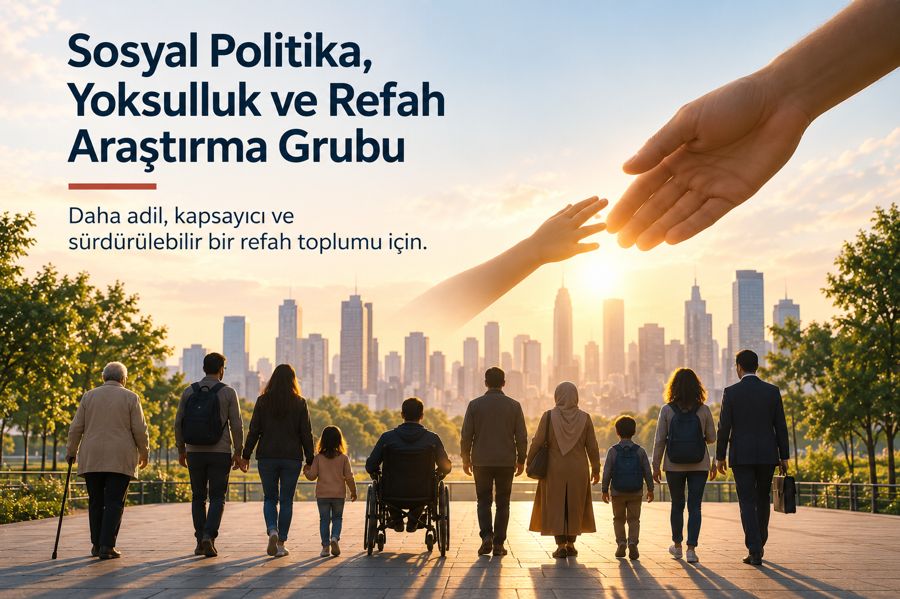

{fig-alt="Sosyal Politika, Yoksulluk ve Refah Araştırma Grubu" fig-align="center" width="100%"}

### Hakkında

Sosyal Politika, Yoksulluk ve Refah Araştırma Grubu; yoksulluk, eşitsizlik, sosyal koruma ve refah politikalarını disiplinlerarası bir perspektifle araştırır. Grubun temel amacı, toplumsal refahın geliştirilmesine ve daha kapsayıcı, adil ve sürdürülebilir sosyal politikaların oluşturulmasına yönelik bilimsel bilgi üretmektir.

Araştırmalar; ekonomik ve sosyal eşitsizliklerin nedenlerini ve sonuçlarını, farklı toplumsal grupların karşı karşıya kaldığı sosyal riskleri ve kamu politikalarının bu risklere yanıt verme kapasitesini ele alır. Akademik araştırma ile politika uygulamaları arasında güçlü bir bağ kurulması grubun temel önceliklerindendir.

### Öncelikli Araştırma Alanları

- Yoksulluk ve çok boyutlu yoksulluk
- Gelir ve servet eşitsizliği
- Sosyal politika ve refah devleti
- Sosyal koruma ve sosyal güvenlik
- Sosyal yardım politikaları
- Çocuk ve aile refahı
- Kadın yoksulluğu ve toplumsal cinsiyet eşitsizlikleri
- Gençlik ve sosyal riskler
- Yaşlılık ve bakım politikaları
- İşsizlik ve çalışan yoksulluğu
- Sosyal dışlanma ve toplumsal bütünleşme
- Dezavantajlı gruplara yönelik politikalar
- Sosyal hizmetler ve bakım ekonomisi
- Sosyal inovasyon ve sosyal ekonomi

### Araştırma Yaklaşımı

Grup, yoksulluk ve refahı yalnızca gelir düzeyi üzerinden değil; **istihdam, eğitim, sağlık, barınma, sosyal katılım ve yaşam kalitesi** gibi çoklu boyutlarıyla ele alır.

Nicel ve nitel araştırma yöntemlerinden yararlanarak sosyal politikaların etkinliğini ve toplumsal etkilerini inceler; ulusal ve uluslararası karşılaştırmalar yoluyla politika alternatiflerini değerlendirir.

### Çalışmalarımız

Araştırma Grubu;

**araştırma projeleri • bilimsel yayınlar • politika analizleri • saha araştırmaları • çalıştaylar • konferanslar • araştırmacı ağları**

aracılığıyla bilgi üretimini ve bilgi paylaşımını destekler.

Akademi, kamu, özel sektör ve sivil toplum kuruluşlarıyla geliştirilen iş birlikleri aracılığıyla araştırma bulgularının politika ve uygulamaya aktarılmasını hedefler.

### Temel Hedef

**Bilimsel araştırma yoluyla yoksulluk ve eşitsizlikle mücadeleye, sosyal korumanın güçlendirilmesine ve toplumun farklı kesimleri için daha kapsayıcı bir refah anlayışının geliştirilmesine katkı sağlamak.**
